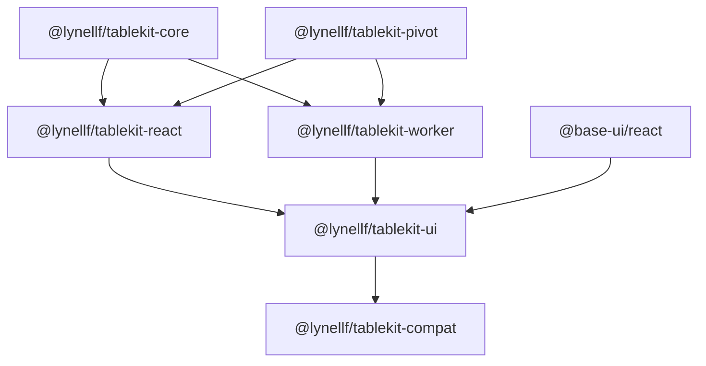

# Table Kit 2.0 Parity Assessment and Remaining-Work Specification

**Repository:** `lynellf/table-kit`  
**Reviewed commit:** `634ad537469b453e9d791cf1b5cd70a4b656b688`  
**Review date:** July 11, 2026  
**Document revision:** 2  
**Review type:** Static source, API, tests, documentation, and CI review

> Revision 2 makes the version reset explicit, pulls the rendering architecture forward, defines a smaller first UI release, records the build-versus-adopt decision, and gates compatibility work on a real consumer migration fixture.

> This assessment defines **migration-grade base parity**, not exhaustive duplication of every Webix or AG Grid feature. It prioritizes the features that make an application team comfortable replacing common DataTable and Pivot usage without immediately rebuilding missing infrastructure around the library.

## 1. Executive assessment

Table Kit has a credible headless foundation:

- A framework-independent table state and row-processing engine.
- Client-side sorting, filtering, pagination, faceting, column ordering, visibility, pinning, sizing, and virtualization primitives.
- React hooks and ARIA-oriented prop getters.
- A real pivot aggregation model with row and column dimensions, measures, filters, totals, lazy expansion, sorting, custom aggregators, and worker/server engine seams.
- A monorepo, package builds, CI, package-artifact checks, tests, and benchmark jobs.

This is not a greenfield project. The current architecture is worth preserving.

It is **not yet a practical drop-in replacement** for Webix DataTable, Webix Pivot, or AG Grid because:

1. There is no packaged product UI.
2. Several common grid workflows are absent: selection, editing, header groups, state persistence, export, autosizing, global filtering, and richer data-update APIs.
3. Pivot lacks an end-user field/configuration UI, per-level subtotals, drill-through, and several formatting and persistence capabilities.
4. The React data-source path and option-update semantics have correctness risks that should block new UI work.
5. Public docs, API-freeze documents, package versions, and actual exports have drifted apart.

### Readiness rating

| Area | Assessment | Notes |
|---|---:|---|
| Headless DataTable architecture | 7/10 | Good state/pipeline separation and useful primitives. |
| Headless Pivot architecture | 7/10 | Strong aggregation seam and result model. |
| React integration | 4/10 | Useful hooks, but option/data-source lifecycle needs hardening. |
| Common DataTable parity | 4/10 | Core display/query features exist; common interaction features do not. |
| Common Pivot parity | 5/10 | Engine is meaningful; product-level configuration and display are incomplete. |
| Styled replacement readiness | 2/10 | No turnkey grid or pivot component. |
| Literal vendor drop-in readiness | 1/10 | No compatibility facade or supported-subset contract. |

These ratings are directional, not code-coverage percentages.

## 2. Recommended product shape

Do not put vendor compatibility behavior directly into the existing headless packages.

Use this package architecture:



### Native package responsibilities

- **`@lynellf/tablekit-core`**  
  Framework-free DataTable state, row models, selection, editing transactions, serialization, export helpers, and virtualization math.

- **`@lynellf/tablekit-pivot`**  
  Framework-free pivot configuration, aggregation, result trees, totals, drill-through contracts, and serialized queries.

- **`@lynellf/tablekit-worker`**  
  Worker and server aggregation transports.

- **`@lynellf/tablekit-react`**  
  Stable React lifecycle integration for the headless engines.

- **`@lynellf/tablekit-ui`**  
  Turnkey React `DataGrid`, `PivotGrid`, field panels, menus, filters, editors, pager, overlays, and themes. Use Base UI for accessible control primitives, not for grid layout or virtualization.

- **`@lynellf/tablekit-compat`**  
  Deliberately bounded Webix and AG Grid configuration adapters. Compatibility warnings and migration helpers belong here.

Separating `ui` and `compat` prevents the native API from becoming a permanent mixture of Webix, AG Grid, and Table Kit terminology.


## 2.1 Architecture decision: build versus adopt

The DataTable roadmap overlaps substantially with TanStack Table, and the rendering roadmap overlaps with TanStack Virtual. This decision must be recorded so it is not re-litigated during every new feature.

### Decision

Retain and evolve the owned Table Kit engine rather than replacing it with TanStack Table.

Use third-party primitives selectively behind Table Kit-owned APIs:

- Base UI for a small set of accessible controls.
- A drag-and-drop library for column and pivot-field rearrangement.
- TanStack Virtual may be evaluated as an internal virtualization implementation during the walking-skeleton spike, but it must not become part of the public Table Kit contract unless a separate architecture decision approves that dependency.

### Rationale for retaining the engine

- The repository already has a released headless engine and a meaningful pivot aggregation model.
- DataTable and PivotTable can share controlled-state, identity, serialization, announcer, and server/worker boundary concepts.
- The named registry and serialization seams are load-bearing for worker and server processing.
- The pivot engine, lazy child computation, and mergeable aggregators are differentiating capabilities rather than wrappers around a generic table library.
- A compatibility package needs stable Table Kit-owned semantics. Building it over another library’s evolving internal model would add a second translation boundary.
- Owning the core allows the project to define a smaller, migration-focused contract rather than inheriting every TanStack feature and vocabulary choice.

### Costs accepted by this decision

- Table Kit owns difficult virtualization, focus, selection, sizing, and editing behavior.
- It must maintain browser and accessibility tests that an adopted grid engine would otherwise provide.
- It must justify its bundle size and behavior against mature alternatives.

### Reconsideration triggers

Revisit the decision if the walking skeleton cannot satisfy the committed scroll, focus, accessibility, or bundle-size budgets without substantial redesign, or if the implementation repeatedly reconstructs TanStack Virtual behavior without Table Kit-specific benefit.

A reconsideration may replace virtualization internals without replacing the Table Kit state and pivot contracts.

## 3. Current-state assessment

## 3.1 Repository and delivery foundation

### Present

- Four publishable packages: core, React, pivot, and worker.
- Node 20 and pnpm workspace.
- TypeScript, Vitest, Biome, Vite, package dry-run checks.
- CI runs type checking, linting, tests, builds, package-artifact verification, a test audit, and advisory pivot/worker benchmarks.
- Examples for server data, main-thread pivot, and worker/server pivot engines.
- Migration-oriented guides for Webix and AG Grid.

### Concerns

- The package manifests are version `1.0.1`, while runtime version constants are inconsistent:
  - core reports `0.2.0`
  - React reports `0.2.0`
  - pivot reports `1.0.0`
- The consolidated API-freeze document lists exports that are not present at the documented package roots.
- Several migration-guide examples and feature claims do not match the current source types.
- No open issues currently track the remaining parity work or the correctness concerns in this assessment.
- The public surface was described as frozen before the product-level replacement surface was defined.

### Recommendation

Rescind the current v1 API freeze and make the contract-correction release **Table Kit 2.0.0**.

The P0 work is not purely additive:

- Correcting pivot change callbacks from `Updater<T>` values to callback functions is a TypeScript contract break for any consumer that modeled the published type literally.
- Correcting `setOptions` changes observable behavior, even though the existing behavior is defective.
- Completing or removing inert pivot state slices changes what the public state contract means.
- Aligning documented and actual exports may require moving, adding, or deprecating imports.

Trying to describe these changes as a v1 patch or minor release would make the versioning story less credible than the defects themselves.

Recommended release policy:

- **v1.x:** maintenance-only. Publish only narrowly safe fixes or security changes.
- **v2.0.0:** contract reset and lifecycle correction. The corrected state, callback, data-source, export, and version contracts become the parity foundation.
- **v2.x:** additive headless primitives, `tablekit-ui`, PivotGrid, and any demand-validated compatibility work.
- **v3.0:** reserved for future architectural corrections discovered after real UI and migration usage.

Publish a concise v1-to-v2 migration guide even if the practical consumer count is currently small.

## 3.2 DataTable capability matrix

Legend:

- **Yes** — implemented at a useful headless level.
- **Partial** — a primitive exists, but important behavior or integration is incomplete.
- **No** — not represented in the current public model.
- **UI gap** — headless support may exist, but no turnkey user interface exists.

| Capability | Current | Assessment |
|---|---|---|
| Explicit columns and accessors | Yes | String and function accessors are supported. |
| Custom cell/header render slots | Yes | Opaque slots are passed through for adapters. |
| Client multi-column sorting | Yes | Registry and inline comparators exist. |
| Client column filtering | Yes | Registry and inline predicates exist. |
| Client pagination | Yes | State and row-pipeline support exist. |
| Server sort/filter/pagination contract | Partial | Query types exist; React lifecycle has blocking issues. |
| Column reorder | Yes | State and helper support exist. |
| Column visibility | Yes | State and helpers exist. |
| Column pinning | Yes | Left/right state and offset math exist. |
| Column resizing | Yes | Headless resize state and React hooks exist. |
| Row virtualization | Yes | Primitive/hook support exists. |
| Column virtualization | Yes | Center-column virtualization exists. |
| Keyboard navigation | Partial | Headless/React primitives exist; full product behavior needs UI integration testing. |
| Cell/row/header events | Yes | Click, double-click, context menu, activation, and focus callbacks exist. |
| Faceted values/min-max | Yes | Useful for constructing filter UIs. |
| Nested column groups | No | Current header builder explicitly creates one header row. |
| Header/footer aggregation rows | No | No general DataTable footer model exists. |
| Column autosize/flex sizing | No | Fixed pixel sizing only. |
| Row selection | No | Deferred in current API-freeze notes. |
| Cell/range selection | No | Focus is not selection. |
| Inline editing | No | No editing state, parser/setter, validation, or commit transaction. |
| Global quick filter | No | Deferred in current API-freeze notes. |
| Row grouping/tree data | No | Pivot grouping does not expose a DataGrid row-grouping model. |
| Pinned rows | No | Column pinning exists; row pinning does not. |
| Cell/row spans | No | No span model. |
| Clipboard copy/paste | No | No headless serialization or paste transaction. |
| CSV export | No | No export helper. |
| Excel/PDF/image export | No | Should remain optional or out of base scope. |
| State save/restore | No | Deferred in current API-freeze notes. |
| Transactional row updates | No | Consumers replace `data`; no add/update/remove transaction API. |
| Undo/redo | No | Best deferred until editing exists. |
| Turnkey column filters | UI gap | No packaged controls. |
| Column/context menus | UI gap | Events exist; menus do not. |
| Pagination controls | UI gap | State exists; pager component does not. |
| Loading/error/empty overlays | Partial | Data-source state exists; no standardized product UI. |
| Theme and density system | No | No UI package. |

### Important correction to existing guides

The current DataTable column definition is flat. The header implementation explicitly states that it returns a single header row and that nested headers were deferred. Existing comparison material should not imply current parity for nested header groups or general footer rows.

## 3.3 Pivot capability matrix

| Capability | Current | Assessment |
|---|---|---|
| Row dimensions | Yes | Multiple row fields are supported. |
| Column dimensions | Yes | Multi-level column trees and leaf columns exist. |
| Multiple measures | Yes | Multiple measure definitions are supported. |
| Built-in aggregation | Yes | Sum, count, min, max, and average. |
| Custom aggregation | Yes | Registry and inline main-thread aggregators. |
| Declarative filters | Yes | Equals, in, not-in, range, and contains. |
| Custom predicates | Yes | Inline main-thread and registry-name boundary forms. |
| Grand-total row | Yes | Engine result and prop-getter support. |
| Grand-total column | Yes | Position and pinned metadata exist. |
| Per-level subtotals | No | Type is declared, but comments state only `none` is honored. |
| Lazy row expansion | Yes | Expanded paths and child computation exist. |
| Server-side child expansion | Partial | Engine seam exists; product integration and UX are not packaged. |
| Sort groups by label | Yes | Level-based pivot sorting. |
| Sort groups by measure | Yes | Level and optional column-path sorting. |
| Worker aggregation | Yes | Worker engine and protocol package exist. |
| Server aggregation | Yes/Partial | Server engine subpath exists; requires contract/integration hardening. |
| Serialized pivot query | Yes | Boundary-safe query types and serialization exist. |
| Row/column virtualization in a PivotGrid | No product | Engine output can support it, but no integrated PivotGrid exists. |
| Column pinning/sizing state | Incomplete | Slices are declared in pivot state, but no pivot mutation API uses them. |
| Focus state | Incomplete | Declared, but the pivot instance lacks a complete focus mutation surface. |
| End-user field list | No | No available-fields panel. |
| Drag fields into rows/columns/values/filters | No | No configuration UI or drag-and-drop behavior. |
| Reorder active fields | Headless only | `setPivot` can replace config; no dedicated commands or UI. |
| Value formatting | Partial | A string `format` hint is passed through; no formatter registry/UI contract. |
| Distinct count and common BI aggregations | No | Custom aggregators can fill gaps, but no standard names/UI. |
| Calculated/derived measures | No | No expression/dependency model. |
| Drill-through to source rows | No | No result-to-source provenance API. |
| Save/restore pivot layout | No helper | Config is serializable in common cases, but no versioned persistence contract. |
| Export flattened pivot | No | No canonical matrix/CSV export helper. |
| Table/tree display modes | Partial | Result is a treegrid-oriented model; no packaged alternate display components. |
| Chart mode | No | Exclude from base parity. |
| End-user filters and measure settings | UI gap | No packaged controls. |
| Turnkey pivot table | UI gap | `usePivotTable` is not a visual component. |

## 4. Blocking correctness and contract work

The following work should be completed before implementing `@lynellf/tablekit-ui`.

## 4.1 Preserve uncontrolled state when React options change

### Finding

`useDataTable` creates a stable instance and calls `table.setOptions(options)` after every render. `setOptions` rebuilds state from defaults plus `initialState` and controlled state. It does not merge current uncontrolled slices into the new state.

A common call site such as this creates a new options object on every render:

```tsx
const { table } = useDataTable({
  data,
  columns,
});
```

After an uncontrolled sort/filter/page update causes a React render, the effect can feed a fresh options object to `setOptions`, which can reconstruct those slices from defaults and erase the user action.

The current uncontrolled hook test uses a module-level constant options object, so it does not exercise the normal inline-options case.

### Required behavior

- `initialState` is constructor-only.
- `setOptions` preserves every current uncontrolled slice.
- A slice present in `options.state` is controlled and always uses the consumer value.
- A slice transitioning from uncontrolled to controlled adopts the provided value.
- A slice transitioning from controlled to uncontrolled keeps the last effective value unless a documented reset API is called.
- Changing data, columns, callbacks, or feature flags must not reset unrelated state.
- Explicit reset methods are separate from option updates.

### Acceptance tests

- Inline options preserve sorting after a user action and re-render.
- Inline options preserve filters, page, order, visibility, pinning, sizing, and focus.
- Updating `data` preserves state.
- Updating `columns` preserves valid state and prunes only invalid column IDs according to a documented reconciliation policy.
- Controlled-to-uncontrolled and uncontrolled-to-controlled transitions are covered.
- React Strict Mode is covered with meaningful assertions.

## 4.2 Rework `useDataSource`

### Findings

The current hook:

- Is invoked conditionally from `useDataTable`, which makes changing `dataSource` presence unsafe under React’s Hooks rules.
- Calls `table.setOptions` with sparse `{ data: [], columns: [], manual* }` objects.
- Can temporarily or persistently replace the real table options with empty data and columns.
- Does not make source identity part of the fetch effect dependency contract.
- Suppresses table changes while a fetch is active instead of reliably aborting and restarting for a newer query.
- Uses table subscriptions in a way that can lose a sort/filter/page change that occurs during an in-flight request.
- Mutates `rowCount` through another sparse `setOptions` call.
- Relies on a `fetchingRef` rather than an explicit request sequence/query identity.

### Required design

Call the data-source hook unconditionally:

```ts
useDataSource(table, options.dataSource ?? null, translator);
```

Derive manual flags before passing options to the table instance, or keep data-source capabilities in a separate internal configuration channel. `useDataSource` must not replace the table’s columns or data options.

Use a query-driven request lifecycle:

```ts
queryKey = stableSerialize({
  sourceKey,
  sorting,
  filters,
  pagination,
  capabilities,
});
```

For each new query key:

1. Abort the previous request.
2. Increment a request token.
3. Set loading state while preserving prior successful data when configured.
4. Start the new request.
5. Accept a result only when token and signal still match.
6. Store `totalRowCount` in data-source state.
7. Announce completion/error.
8. Never skip a newer state change because a prior request is active.

### Acceptance tests

- Adding or removing `dataSource` across renders does not violate hook ordering.
- Changing source triggers a new request.
- Changing sort, filter, or page during a request aborts/replaces it.
- A stale response cannot overwrite a newer response.
- Real column definitions remain available when building serialized filter queries.
- Controlled and uncontrolled slices work with server data.
- Sparse options are never written into the table instance.
- Offset and cursor pagination can be represented without conflating them.

## 4.3 Correct pivot callback types

### Finding

Pivot options type `onPivotChange`, `onExpandedChange`, `onPivotSortingChange`, and `onStateChange` as `Updater<T>` values. The factory uses them as callback functions receiving an updater. README examples pass React state setters, which reflects the intended behavior but conflicts with the declared types.

### Required change

Introduce and use a callback type consistent with core:

```ts
export type OnChangeFn<T> = (updater: Updater<T>) => void;

interface PivotTableOptions<TRow> {
  onPivotChange?: OnChangeFn<PivotConfig<TRow>>;
  onExpandedChange?: OnChangeFn<PivotExpansionState>;
  onPivotSortingChange?: OnChangeFn<PivotSortingState>;
  onStateChange?: OnChangeFn<PivotTableState>;
}
```

Add type-level tests with React setters and normal callback functions.

## 4.4 Finish or remove dead pivot state slices

Pivot state declares:

- `columnPinning`
- `columnSizing`
- `columnSizingInfo`
- `focusedCell`

The pivot instance does not expose a corresponding complete set of setters or rendering behavior.

Because the public API is already released, prefer additive completion:

- `setColumnPinning`
- `setColumnSizing`
- resize session commands
- `setFocusedCell`
- controlled callbacks for each slice
- leaf-column size resolution from state
- pinned-region calculation
- focus/keyboard integration

If these are intentionally UI-only concerns, move them out of the pivot engine in the next major version. Do not leave them as apparently supported but inert public state.

## 4.5 Align exports, versions, and documentation

### Required work

- Generate or inject `VERSION` from package metadata during build.
- Add an export-contract test that imports every documented root and subpath export.
- Make package root exports and `api-freeze.md` agree.
- Correct which package owns treegrid keyboard helpers.
- Correct whether `validate` and worker helpers are root exports or subpath exports.
- Regenerate API tables from TypeScript declarations where practical.
- Rewrite migration guides against executable examples and type tests.
- Mark feature matrices as:
  - implemented
  - primitive only
  - UI required
  - unsupported
  - deferred
- Remove stale milestone comments from production files.
- Add a docs check that fails for version drift and broken package examples.

## 4.6 Improve data identity comparisons

The DataTable data-source state uses `JSON.stringify` to compare different data references. The pivot factory recursively deep-compares datasets.

These strategies are expensive for large tables and unsafe for cyclic or unusual values.

### Required policy

- Treat data identity as reference-based by default.
- Document an explicit **immutability expectation**: mutating the existing row array or row objects in place is unsupported unless the consumer also changes a version token.
- Allow an optional `dataVersion` or `getDataVersion` for mutable-source integrations.
- Use stable row IDs and transactions for incremental add/update/remove changes.
- Do not perform unconditional deep equality over large row sets in `setOptions`.
- Development warnings may detect common mutation-in-place mistakes when inexpensive.
- Benchmark option updates separately from aggregation and row-model work.

## 4.7 Make announcer ownership instance-safe

Both table and pivot hooks should support multiple grids on a page without replacing a process-global announcer unexpectedly.

Preferred direction:

- Announcer is instance-owned.
- React live-region components subscribe to an instance channel.
- A global default may remain as a fallback, but mounting/unmounting one grid must not disable announcements for another.

## 5. Definition of base parity

## 5.1 DataGrid base parity

A DataGrid is at migration-grade base parity when it provides:

### Required display and layout

- Flat and grouped column definitions.
- Multi-row headers with correct spans.
- Custom header and cell renderers.
- Column reorder, visibility, pinning, resizing, autosize, and flex sizing.
- Row and column virtualization.
- Configurable fixed row height in the first UI release; measured variable height only after the D2 risk gate passes.
- Header, body, and optional footer rows.
- Empty, loading, error, and no-results overlays.
- Density and theme tokens.
- RTL-ready layout.

### Required data operations

- Client and server sorting.
- Client and server column filtering.
- Global quick filtering.
- Client and server pagination.
- Stable row IDs.
- Add/update/remove transactions.
- Refresh and invalidation APIs.
- Faceted filter values.
- Versioned state serialization and hydration.

### Required interaction

- Single and multiple row selection.
- Checkbox selection.
- Single-cell selection.
- Optional rectangular range selection.
- Keyboard navigation and screen-reader announcements.
- Cell and row context menus.
- Inline cell editing.
- Value parsing, validation, commit/cancel, and async save status.
- Copy selected cells/rows.
- Paste through a validated transaction.
- CSV export.

### Required product controls

- Column menu.
- Column chooser.
- Sort and filter controls.
- Filter row or floating-filter option.
- Pager.
- Quick-filter input.
- Selection summary.
- Export action.
- Optional status bar.

## 5.2 PivotGrid base parity

A PivotGrid is at migration-grade base parity when it provides:

- Available-field metadata.
- Configurable row, column, value, and filter areas.
- Reorderable active fields.
- Multiple measures.
- Sum, count, distinct count, min, max, and average.
- Custom aggregation registry.
- Grand totals and per-level subtotals.
- Row expansion/collapse.
- Label and measure sorting.
- Global/data filters and field-level filter controls.
- Worker and server aggregation.
- Loading, error, and retry states.
- Row and column virtualization.
- Value formatting.
- Versioned layout persistence.
- Flattened CSV export.
- Drill-through callback or source-row query.
- Accessible field-builder controls and treegrid interaction.

Chart mode, formula editors, and full BI “show values as” calculations are not required for the first base-parity release.

## 6. Implementation plan

The work is split into a contract foundation, a DataGrid track, a Pivot track, and a demand-gated compatibility track. The goal is to produce usable releases continuously instead of completing every headless primitive before testing a real rendering architecture.

## 6.1 Release train

| Release | Purpose | Required outcome |
|---|---|---|
| **2.0.0** | Contract reset | Correct state, callback, data-source, export, version, and announcer contracts. |
| **2.1.0** | Rendering architecture preview | Internal or prerelease DataGrid walking skeleton validates pinned regions, virtualization, grouped headers, focus, SSR posture, and bundle budgets. |
| **2.2.0** | First shippable DataGrid | Read-mostly DataGrid with sorting, filtering, pagination, column management, row selection, persistence, loading states, and CSV export. No editing or rectangular range selection. |
| **2.3.0** | First shippable PivotGrid | PivotGrid with field metadata, field panel, row/column/value/filter areas, totals, worker/server engines, persistence, formatting, CSV, and drill-through query support. |
| **2.4+** | Advanced interaction | Editing, paste transactions, cell/range selection, row grouping/tree data, and validated compatibility adapters. |

Package versions should remain aligned across the monorepo unless a later release policy explicitly allows independent versioning.

## Track F — 2.0 contract and lifecycle foundation

**Goal:** Make the current headless and React packages safe to build upon.

### F0.1 DataTable option semantics

- Preserve uncontrolled state in `setOptions`.
- Define controlled/uncontrolled transition behavior.
- Add `resetState`, `resetSlice`, and state reconciliation for removed columns.
- Make `initialState` constructor-only.
- Add regression tests using normal inline React options.

### F0.2 Data-source lifecycle

- Call a nullable data-source hook unconditionally.
- Remove all sparse `setOptions` writes.
- Use request tokens and `AbortController`.
- Derive a stable query key.
- Handle data-source identity changes.
- Implement explicit stale-while-revalidate behavior.
- Keep total-row count in data-source state rather than mutating table options.
- Support offset and cursor pagination as distinct query strategies.

### F0.3 Pivot type and state contract

- Correct change-callback types.
- Implement or deprecate inert pivot sizing, pinning, resize-session, and focus slices.
- Add type tests with React setters and ordinary callback functions.
- Add controlled-state integration tests.

### F0.4 Contract automation

- Align runtime and package versions.
- Align actual exports and documentation.
- Add declaration-based export snapshots.
- Add clean-package consumer fixtures.
- Rewrite migration guides against type-checked examples.
- Publish the v1-to-v2 migration guide.
- Mark the v1 freeze as superseded rather than silently editing its historical claims.

### F0.5 Multi-instance accessibility

- Make announcers instance-owned.
- Add Strict Mode lifecycle tests.
- Add multiple-grid and multiple-pivot tests.
- Verify mounting or unmounting one component does not disable another component’s announcements.

### Foundation exit criteria

- `pnpm verify` passes.
- All lifecycle regressions are covered.
- No public guide claims unsupported functionality.
- Package and runtime versions agree.
- Every documented import is exercised by a consumer fixture.
- v2 migration notes identify every intentional contract or behavior change.

## Track D — DataGrid

## D1 Column hierarchy and deterministic sizing

Add recursive column groups, footer slots, flex sizing, and autosize contracts.

```ts
interface ColumnGroupDef<TRow> {
  id: string;
  header?: unknown;
  children: Array<ColumnDef<TRow> | ColumnGroupDef<TRow>>;
  meta?: Record<string, unknown>;
}

interface ColumnDef<TRow, TValue = unknown> {
  // existing fields
  footer?: unknown;
  flex?: number;
  autoSize?: boolean;
}
```

Implement:

- Recursive column flattening.
- Header depth and placeholders.
- Correct row and column spans.
- Group visibility and reorder policy.
- Grouped pinning rules.
- Autosize measurement contracts.
- Flex distribution with minimum and maximum constraints.
- Header and footer prop getters.

### D1 acceptance

- Arbitrary header depth is represented correctly.
- ARIA indices and spans are correct.
- Pinning and center virtualization work with grouped columns.
- Sizing is deterministic and unit-tested.
- The server-rendered initial layout has deterministic fixed widths and does not depend on DOM measurement.

## D2 Walking skeleton — pulled forward

**Goal:** Validate the highest-risk rendering architecture before building editing, range selection, or a broad UI component set.

Immediately after D1, build a minimal internal `DataGrid` shell with:

- One vertical scrolling authority.
- Left, center, and right column regions.
- Center-column horizontal virtualization.
- Shared row identity and fixed-height measurements across all regions.
- Sticky grouped headers.
- Column resize and reorder.
- Sort and basic filter controls.
- Keyboard focus across virtualized cells.
- LTR and RTL smoke tests.
- Loading and empty states.
- No editing.
- No cell-range selection.
- No measured variable row height.

```text
┌─────────────── DataGrid root ───────────────────────────────┐
│ minimal controls                                            │
├──────────────┬──────────────────────────────┬───────────────┤
│ pinned left  │ virtualized center viewport  │ pinned right  │
│ headers      │ headers                      │ headers       │
├──────────────┼──────────────────────────────┼───────────────┤
│ rows         │ vertical + horizontal scroll │ rows          │
│ synchronized │                              │ synchronized  │
└──────────────┴──────────────────────────────┴───────────────┘
```

### D2 engineering risks and fallback

Variable row height is a named risk because each row must remain aligned across three rendered regions while measurements change.

The first shippable DataGrid will use **fixed row heights**. Variable/measured row height is accepted only after a prototype demonstrates:

- Stable shared measurements.
- No vertical drift between pinned and center regions.
- Correct scroll anchoring.
- Bounded relayout cost.
- Focus stability while measurements change.

If those criteria are not met, variable row height remains deferred rather than weakening the initial release.

### D2 build-versus-adopt checkpoint

Benchmark the owned virtualizer against a small TanStack Virtual prototype using the same grouped-header and pinned-region fixture. Record the result in an ADR. The public API remains Table Kit-owned either way.

### D2 exit criteria

- Representative wide and tall grids scroll without visible region drift.
- Focus and selection identity do not duplicate across pinned regions.
- Header groups remain aligned while horizontally virtualized.
- RTL has an explicit supported behavior or a documented limitation.
- The initial bundle-size budget is measured.
- The docs/demo host can render the shell without application-specific scaffolding.

## D3 First-release headless primitives

These primitives are required for the first shippable, read-mostly DataGrid.

### D3.1 Row selection

Add:

```ts
interface DataTableState {
  // existing slices
  rowSelection: Record<string, boolean>;
}
```

Support:

- Single and multiple row selection.
- Checkbox selection.
- Select-all scope: page, filtered data, or all-known rows.
- Row-selectability predicates.
- Shift-range row selection.
- Controlled and uncontrolled selection.
- Versioned selection serialization where enabled.

Focus remains distinct from selection.

### D3.2 Global and type-aware filtering

Add:

- Global quick-filter state.
- Text, number, date, boolean, and set filter models.
- Compound AND/OR conditions.
- External filter predicates.
- Serializable server filter shapes.
- Filter-model versioning.
- Server facet-loading contracts.

### D3.3 Persistence

Add:

```ts
serializeTableState(state, options): SerializedTableState
hydrateTableState(value, schema): Partial<DataTableState>
```

Requirements:

- Explicit schema version.
- Column-ID reconciliation.
- Optional inclusion of selection, filters, pagination, order, pinning, and sizing.
- Safe handling of unknown fields.
- Migration hooks between schema versions.
- No functions in serialized output.

### D3.4 CSV and copy

Add headless utilities for:

- Selected rows to tabular text.
- Visible rows to CSV.
- CSV escaping and streaming row generation.
- Value formatting and included-column hooks.

Clipboard paste is not included in the first release because it depends on editing transactions.

### D3.5 Data refresh and transactions

Add stable, non-editing-oriented row updates:

```ts
interface RowTransaction<TRow> {
  add?: TRow[];
  update?: TRow[];
  remove?: string[];
}
```

The core never mutates consumer rows in place.

## D4 First shippable `@lynellf/tablekit-ui` DataGrid

### D4.1 Package and dependency policy

`@lynellf/tablekit-ui` provides the turnkey React component and composable subcomponents.

Base UI should be an internal runtime dependency unless Table Kit directly exposes Base UI types. Do not make consumers coordinate a Base UI peer version unnecessarily.

Use only the controls required by the first DataGrid/PivotGrid releases:

- Menu and Context Menu
- Popover
- Checkbox
- Select or Combobox
- Input, Field, and Number Field
- Dialog where a modal editor or column chooser requires it
- Tooltip only where the interaction cannot be expressed accessibly without one

Do not include Toast, Progress, Toolbar, or Drawer in the initial dependency/design contract. Loading indicators, notifications, and application shell behavior remain host-application concerns.

Base UI is a young dependency. Pin and test a supported version range, avoid re-exporting its internal types, and place all usage behind Table Kit components so it can be replaced without a Table Kit API break.

### D4.2 First-release component scope

The first DataGrid release includes:

- Virtualized fixed-height rows.
- Grouped headers.
- Sorting.
- Column and global filtering.
- Client and server pagination.
- Column visibility, order, pinning, resizing, autosize, and flex sizing.
- Row selection and checkboxes.
- State persistence.
- Loading, error, no-results, and empty states.
- Column menu and chooser.
- Pager and quick-filter controls.
- CSV export.
- Accessible keyboard navigation and announcements.
- Light/dark themes and density tokens.

Explicitly excluded from this release:

- Cell editing.
- Paste transactions.
- Cell or rectangular range selection.
- Undo/redo.
- Fill handle.
- Variable row height.
- Row grouping and tree data.

### D4.3 Native API

```tsx
<DataGrid
  rows={rows}
  columns={columns}
  getRowId={(row) => row.id}
  rowSelection="multiple"
  state={state}
  onStateChange={setState}
  dataSource={source}
  quickFilter
  columnMenu
  columnChooser
  pagination
/>
```

Composable form:

```tsx
<DataGrid.Root>
  <DataGrid.Controls />
  <DataGrid.Header />
  <DataGrid.Body />
  <DataGrid.Footer />
  <DataGrid.Pager />
</DataGrid.Root>
```

The turnkey and composable forms must share the same engine and behavior tests.

### D4.4 SSR and React Server Components posture

The headless core and pivot packages should remain DOM-free and SSR-safe.

The first UI package is explicitly a **client-component package**:

- Entry points that use hooks or DOM measurement declare the client boundary.
- Next.js and other RSC documentation shows where `"use client"` is required.
- Server output uses deterministic fixed sizes and does not attempt autosize or measured-height work.
- Autosize and any DOM measurement begin after hydration.
- Hydration must not reorder rows or columns.
- No browser globals are read during module initialization.
- A clean Next.js-style consumer fixture is part of package verification.

A future server-rendered static-table adapter may be additive, but it is not required for the first UI release.

### D4.5 UI strings and locale contract

Value formatting and interface strings are separate concerns.

Add a UI labels contract for:

- Pager labels.
- Column menu actions.
- Filter operators.
- Empty/loading/error text.
- Selection summaries.
- Export actions.
- Column chooser text.
- Validation and editor messages in later releases.
- Announcer messages.

```ts
interface DataGridLabels {
  nextPage: string;
  previousPage: string;
  columns: string;
  filters: string;
  noRows: string;
  noResults: string;
  // ...
}
```

Support per-key overrides and locale packs without coupling them to `Intl` value formatting.

### D4.6 Styling and theming

Ship:

- CSS variables for color, typography, spacing, borders, focus rings, row height, and header height.
- Light and dark themes.
- Compact, standard, and comfortable density.
- High-contrast-safe defaults.
- Stable class names and data attributes.
- No required runtime CSS generation.
- A documented theme-token contract.

### D4.7 Docs and demo site

Build a versioned docs/demo application as a first-class work package.

It owns:

- Interactive DataGrid and PivotGrid examples.
- Migration examples.
- Feature-matrix pages.
- Accessibility notes.
- SSR/RSC integration examples.
- Performance fixtures.
- Bundle-size reporting.
- The Playwright browser-test host.
- Visual-regression fixtures.

The demo site must use only published or workspace package APIs, not private source imports.

## D5 Advanced DataGrid interaction — after the first UI release

### D5.1 Cell and range selection

Add:

- Single-cell selection.
- Rectangular range selection.
- Keyboard extension.
- Copy of selected ranges.
- Clear separation among focus, active cell, and selected range.

### D5.2 Editing and paste transactions

Add a headless editing contract:

```ts
interface ColumnDef<TRow, TValue> {
  editable?: boolean | ((ctx: CellContext<TRow, TValue>) => boolean);
  valueParser?: (input: unknown, ctx: CellContext<TRow, TValue>) => TValue;
  valueSetter?: (row: TRow, value: TValue, ctx: CellContext<TRow, TValue>) => TRow;
  validate?: (value: TValue, ctx: CellContext<TRow, TValue>) =>
    void | string | Promise<void | string>;
}
```

Implement:

- Active editor state.
- Start, commit, and cancel.
- Optimistic and pessimistic save modes.
- Sync and async validation.
- Consumer-owned mutation callbacks.
- Clipboard parsing.
- Paste-to-transaction mapping.
- Editor focus behavior under virtualization.

Undo/redo and fill handle remain later subphases.

### D5.3 Advanced row models

After editing and range behavior stabilize:

- Row grouping.
- Tree data.
- Pinned top and bottom rows.
- Infinite or block-cache data sources.
- Master/detail.
- Cell and row spans.
- Row dragging.
- Change highlighting.
- Variable row height, if the D2 risk gate is satisfied.

## Track P — PivotGrid

Pivot work can proceed after the 2.0 foundation and in parallel with later DataGrid work, but the first PivotGrid should reuse the proven D2 rendering shell rather than inventing a second scrolling system.

## P1 Field metadata and configuration model

Add:

```ts
interface PivotFieldDef<TRow> {
  id: string;
  label: string;
  dataType: "string" | "number" | "date" | "boolean";
  accessor?: (row: TRow) => unknown;
  accessorRef?: string;
  allowedAreas?: Array<"rows" | "columns" | "measures" | "filters">;
  defaultAggregator?: string;
  formatter?: string | PivotValueFormatter;
}
```

This becomes the source for the field list, filter UI, formatter registry, and default aggregation behavior.

## P2 Totals, aggregation, and formatting

Implement:

- Per-level subtotals.
- Subtotal position.
- Distinct count.
- First/last and optional median.
- Per-measure total operation.
- Custom total labels.
- Empty-value and null/NaN policy.
- Stable aggregator metadata for worker/server boundaries.
- Formatter registry.
- Locale-aware number/date/currency/percent formatting.
- Per-measure formatter.
- Result-cell metadata.

Calculated measures remain additive after the first PivotGrid release and must use explicit dependencies and serializable expressions rather than arbitrary code strings.

## P3 Drill-through primitive

Ship the query-object primitive:

```ts
pivot.getDrillThroughQuery(cell): DrillThroughQuery
```

Then expose UI callback sugar:

```ts
onDrillThrough={(context) => {
  const query = pivot.getDrillThroughQuery(context.cell);
  // open application-owned detail view
}}
```

Main-thread engines may include source row IDs. Server engines return a serializable query. The callback and query object are complementary, not alternatives.

## P4 Persistence, export, and server processing

Add:

- Versioned pivot-layout serialization.
- Field-ID validation on hydration.
- Optional expansion and sorting persistence.
- Canonical flattened matrix representation.
- CSV export.
- Distinct-filter-value requests.
- Child expansion.
- Drill-through requests.
- Retry and error metadata.
- Cancellation.
- Schema/version negotiation.
- Request IDs and observability hooks.

## P5 First shippable PivotGrid UI

Ship:

- Available-field panel.
- Row, column, measure, and filter areas.
- Reordering of active fields.
- Multiple measures.
- Field and measure settings.
- Grand totals and per-level subtotals.
- Expansion/collapse.
- Label and measure sorting.
- Worker and server engines.
- Loading, error, retry, and empty states.
- Fixed-height row virtualization and center-column virtualization.
- Value formatting.
- Layout persistence.
- Flattened CSV export.
- Drill-through callback backed by `getDrillThroughQuery`.
- Accessible field-builder controls and treegrid interaction.

Chart mode, formula editors, and full BI “show values as” calculations are not part of the first PivotGrid release.

## Track C — Compatibility and migration

Compatibility is not automatically part of the parity roadmap. It begins only when concrete migration demand justifies maintaining vendor-shaped APIs.

## C0 Compatibility entry gate

No general-purpose Webix or AG Grid adapter starts until all of the following are true:

1. At least one real consumer application is selected.
2. Its configuration surface is checked in as a sanitized golden fixture.
3. The target migration workflows and acceptance tests are documented.
4. The native Table Kit API and codemods are shown to be insufficient on their own.
5. An owner accepts ongoing compatibility maintenance.

For external adoption, the fixture corpus must include real third-party configurations contributed with permission. Synthetic fixtures may supplement but may not define the supported surface by themselves.

The first migration attempt should prefer:

- A codemod.
- A configuration translator used during migration.
- Native Table Kit APIs.
- Focused imperative shims required by the selected application.

Only repeated demand across applications justifies a broad runtime compatibility component.

## C1 Compatibility policy

Classify every supported vendor option or method as:

- **Mapped** — behavior and shape are intentionally supported.
- **Adapted** — close behavior with documented semantic differences.
- **Unsupported** — actionable development warning; no silent fallback.

Never advertise “drop-in” without publishing the exact supported subset.

## C2 Candidate Webix mappings

Potential DataTable mappings, subject to the C0 gate:

- `columns`
- `data`
- `select`
- `sort`
- `pager`
- `leftSplit` and `rightSplit`
- header filters
- common event names
- common formatter/template callbacks
- state get/set
- show/hide column
- set column width
- selection methods
- CSV export
- editing methods only after D5 ships

Potential Pivot mappings:

- `structure.rows`
- `structure.columns`
- `structure.values`
- `structure.filters`
- `defaultOperation`
- custom operations and predicates
- external processing
- readonly mode
- structure get/set
- common formatting and totals

Explicit non-goals include the Webix global view registry, full widget lifecycle, Jet internals, DataStore synchronization, spreadsheet math, and arbitrary Webix HTML-template semantics.

## C3 Candidate AG Grid mappings

Potential DataGrid mappings, subject to the C0 gate:

- `rowData`
- `columnDefs`
- `defaultColDef`
- `getRowId`
- sorting and filter models
- pagination
- row selection
- pinned columns
- column sizing/order/visibility
- common cell and row events
- context-menu callbacks
- CSV export
- state save/restore
- editing APIs only after D5 ships

Potential Pivot mappings:

- `pivotMode`
- row-group fields
- pivot fields
- aggregation functions
- pivot totals
- a bounded column/pivot field-panel subset

Do not claim support for the AG Grid module system, integrated charts, Excel parity, full enterprise server-side row-model parity, master/detail parity, every custom component interface, formulas, the full Grid API, or vendor DOM/theme classes.

## C4 Migration tooling

When the C0 gate is met, add:

- Config validator reporting mapped/adapted/unsupported fields.
- Development warnings with documentation codes.
- Migration report CLI.
- Codemods for imports and common prop names.
- Real consumer golden fixtures.
- A checked-in compatibility test matrix.
- Before/after examples in the docs site.

## 7. Sequenced backlog

| Sequence | Track | Work item | Size | Blocks |
|---:|---|---|---:|---|
| 1 | Foundation | Preserve uncontrolled state across `setOptions` | M | All v2 React work |
| 2 | Foundation | Rewrite data-source lifecycle | L | Server-backed UI |
| 3 | Foundation | Correct pivot callback types | S | Stable pivot API |
| 4 | Foundation | Complete/deprecate inert pivot slices | M | PivotGrid state |
| 5 | Foundation | Align exports, versions, freeze status, and docs | M | 2.0 release |
| 6 | Foundation | Lifecycle and package-consumer regressions | M | 2.0 release |
| 7 | DataGrid | Nested columns and deterministic sizing | L | Walking skeleton |
| 8 | DataGrid | Three-region fixed-height walking skeleton | XL | UI architecture |
| 9 | DataGrid | Row selection | M | First DataGrid |
| 10 | DataGrid | Global and type-aware filters | L | First DataGrid |
| 11 | DataGrid | State persistence | M | First DataGrid |
| 12 | DataGrid | CSV/copy and non-editing row transactions | M | First DataGrid |
| 13 | DataGrid | Turnkey UI controls, themes, labels, SSR docs | XL | First DataGrid |
| 14 | DataGrid | Docs/demo and Playwright host | L | First DataGrid |
| 15 | Pivot | Field metadata and configuration model | M | Pivot field panel |
| 16 | Pivot | Subtotals, aggregations, and formatting | L | First PivotGrid |
| 17 | Pivot | Drill-through query, persistence, export, server contract | L | First PivotGrid |
| 18 | Pivot | Field panel and PivotGrid UI | XL | Pivot product |
| 19 | DataGrid | Cell/range selection | L | Copy/paste workflows |
| 20 | DataGrid | Editing and paste transactions | XL | Editable grid |
| 21 | Compatibility | First real consumer fixture and migration spike | M | Adapter decision |
| 22 | Compatibility | Bounded Webix or AG Grid adapter, if gate passes | XL | Repeated migrations |
| 23 | Advanced | Grouping, tree data, infinite model, variable height | XL | Advanced parity |
| 24 | Advanced | Master/detail, spans, fill handle, charts | XL | None |

## 8. Testing strategy

## 8.1 Unit and type tests

- Every state slice: controlled, uncontrolled, transition, reset, serialization.
- Column tree flattening and span calculation.
- Selection range math.
- Editing parser/setter/validation.
- Clipboard and CSV escaping.
- Pivot subtotal and drill-through provenance.
- Boundary serialization rejects inline functions.
- Public callback and renderer types use `tsd` or equivalent declaration tests.

## 8.2 React integration tests

- Inline options, callback replacement, data replacement, and column replacement.
- Strict Mode.
- Multiple table and pivot instances.
- Dynamic data-source add/remove/change.
- Stale request cancellation.
- Focus retention under virtualization.
- Pinned/center/right region synchronization.
- Editor mount/unmount during scrolling.

## 8.3 Browser tests

Use Playwright for:

- Keyboard-only grid operation.
- Selection and editing workflows.
- Column resize/reorder/pinning.
- Context menus and filter popovers.
- Virtualized scroll and focus.
- Pivot field drag/drop.
- Mobile pointer/touch smoke tests.
- RTL layout.
- Light/dark/high-contrast visual snapshots.

## 8.4 Compatibility tests

For each supported Webix/AG Grid option:

- Input fixture.
- Normalized native configuration snapshot.
- Render/behavior assertion.
- Documented semantic difference, if adapted.
- Warning assertion, if unsupported.

## 8.5 Performance tests

Commit repeatable benchmark scenarios:

### DataGrid

- 10,000 and 100,000 rows.
- 25 and 100 columns.
- Fixed row height for the first-release baseline.
- Measured variable row height only after the D2 risk gate passes.
- Pinned columns.
- Sort/filter/page transitions.
- Fast transactional updates.
- Scroll DOM count and memory stability.

### Pivot

- 100,000 and 1,000,000 source rows where worker hardware permits.
- Multiple row/column cardinalities.
- One and multiple measures.
- Expansion and collapse.
- Subtotal cost.
- Main-thread, worker, and server fixture modes.

Use committed baselines and fail only on statistically meaningful regressions. The current advisory benchmark pattern can be extended before hard thresholds are introduced.

## 9. Release gates

### 9.1 Table Kit 2.0 contract release

`2.0.0` is ready only when:

- The v1 freeze is explicitly superseded.
- State and data-source lifecycle bugs are fixed and regression-tested.
- Pivot callback and inert-state contracts are corrected.
- Runtime and package versions agree.
- Every documented import is exercised in a clean consumer project.
- A v1-to-v2 migration guide is published.
- No guide uses an API shape that fails type checking.

### 9.2 First DataGrid release

The first `tablekit-ui` DataGrid is ready only when:

- The three-region fixed-height rendering architecture passes browser and visual tests.
- Native demos require no consumer-written grid scaffolding.
- The docs/demo site is published and serves as the Playwright host.
- The supported feature matrix is checked against code.
- Accessibility browser tests pass.
- SSR/RSC posture and client boundaries are documented and tested.
- UI labels support per-key overrides.
- Performance baselines are committed.
- Package tarball consumer tests pass in a clean React project and an RSC-oriented fixture.
- Bundle budgets pass.

Initial bundle budgets, measured as minified and gzip-compressed production ESM:

| Artifact | Initial budget |
|---|---:|
| `@lynellf/tablekit-core` primary entry | 20 kB gzip |
| `@lynellf/tablekit-react` incremental cost | 12 kB gzip |
| `@lynellf/tablekit-pivot` primary entry | 25 kB gzip |
| `@lynellf/tablekit-ui` minimal DataGrid path | 60 kB gzip |
| Optional PivotGrid field-panel path | 40 kB gzip incremental |

These are starting budgets, not promises that override correctness. Any increase requires a recorded rationale and updated comparison in CI.

### 9.3 Compatibility release

A compatibility adapter is ready only when:

- The C0 real-consumer gate has passed.
- The supported subset is published as Mapped, Adapted, or Unsupported.
- Real consumer golden fixtures pass.
- Unsupported vendor features produce actionable warnings rather than silent behavior changes.
- Migration documentation compares the adapter with the native-API/codemod path.

## 10. Non-goals for the first parity release

- Pixel-perfect Webix or AG Grid visual cloning.
- Webix global view registry and full imperative widget lifecycle.
- AG Grid’s entire Grid API.
- Integrated charting.
- Spreadsheet formula engine.
- Excel/PDF/PNG export parity.
- Full enterprise server-side row model.
- Master/detail.
- Every drag-and-drop workflow.
- Recreating vendor-specific DOM structures or CSS class names.
- Supporting arbitrary serialized functions across worker/server boundaries.

## 11. High-confidence source findings

The most important source locations reviewed were:

- `packages/core/src/types.ts` — current DataTable state and flat `ColumnDef`.
- `packages/core/src/headers.ts` — single-row header implementation.
- `packages/core/src/createDataTable.ts` — option/state and data-source seams.
- `packages/react/src/useDataTable.ts` — per-render option effect and conditional data-source hook.
- `packages/react/src/useDataSource.ts` — sparse option writes and request lifecycle.
- `packages/pivot/src/types.ts` — pivot state, callback declarations, subtotal note, engine contract.
- `packages/pivot/src/pivotTable/factory.ts` — state orchestration and compute lifecycle.
- `packages/react/src/usePivotTable.ts` — React pivot lifecycle and announcer behavior.
- `packages/core/src/index.ts`, `packages/react/src/index.ts`, and `packages/pivot/src/index.ts` — runtime versions and real exports.
- `docs/m6-hardening/api-freeze.md` — documented exports and deferred items.
- `.github/workflows/test.yml` — verification and benchmark jobs.
- `docs/guides/*` — current migration matrices and examples.

External parity targets were checked against the current official Webix DataTable, Webix Pivot, AG Grid Data Grid/Pivoting, and Base UI documentation.

## 12. Bottom line

The repo is a solid **headless engine project**, especially for pivot aggregation. It is not currently a **replacement product**.

The credible path is:

1. Declare the current freeze superseded and ship an honest `2.0.0` contract reset.
2. Add grouped columns and immediately build the three-region fixed-height walking skeleton.
3. Ship a deliberately read-mostly first DataGrid with selection, filtering, persistence, and CSV—but no editing or range selection.
4. Reuse the validated rendering shell for the PivotGrid and field workspace.
5. Add editing and paste transactions only after the first DataGrid is stable.
6. Begin compatibility work only after a real consumer configuration proves that codemods and native APIs are insufficient.

This sequencing tests the riskiest rendering assumptions early, creates smaller usable releases, and avoids committing to two general-purpose compatibility layers before there is evidence that they are the cheapest migration mechanism.
