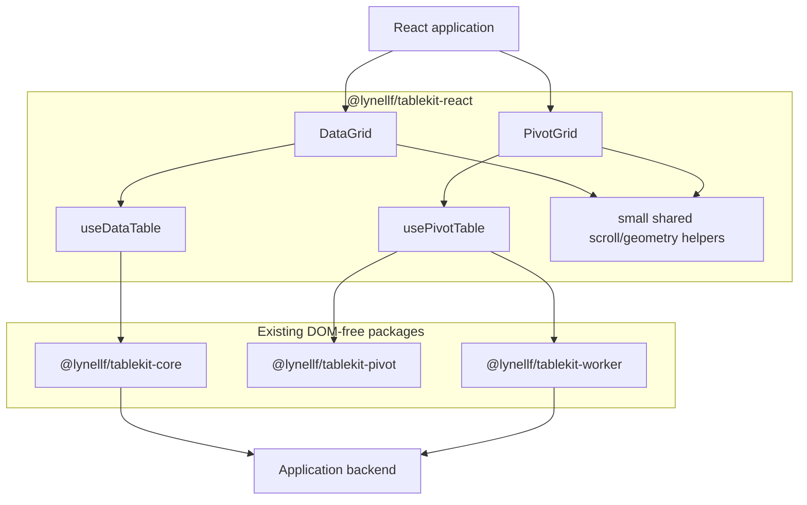
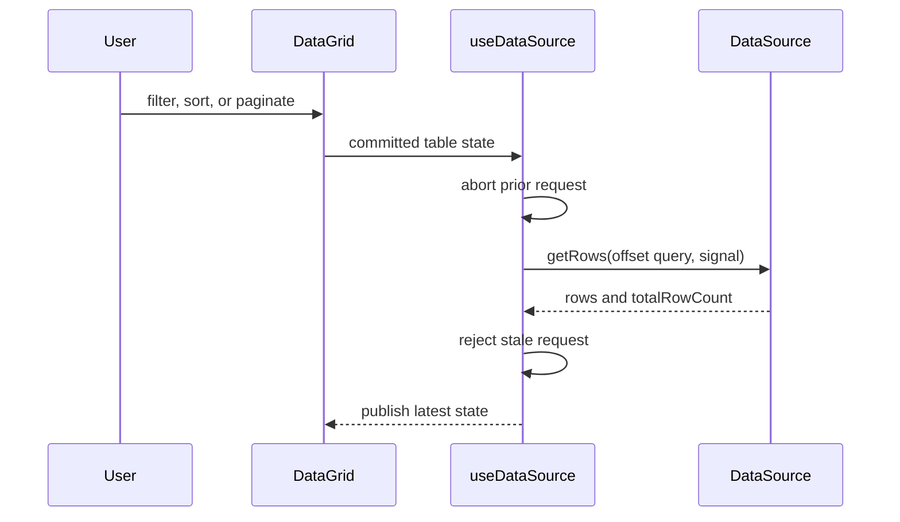

# Table Kit MVP Functional Parity — One-Shot Spec

**Target:** `fix/resolve-open-issues`\
**Implementer:** GPT-5.6 Terra, medium reasoning\
**Reviewer:** separate GPT-5.6 Sol session\
**Supersedes:** active routing under `docs/table-kit-2.0-parity-plan/`

## Goal

Ship usable React `DataGrid` and `PivotGrid` components covering these
workflows:

| Area      | Required                                                       |
| --------- | -------------------------------------------------------------- |
| DataGrid  | Client and server filtering, sorting, offset pagination        |
| DataGrid  | Fixed-height row virtualization and column virtualization      |
| DataGrid  | Single/multiple row selection                                  |
| DataGrid  | Row/cell click and double-click handlers                       |
| PivotGrid | Client and server aggregation                                  |
| PivotGrid | Expandable row groups                                          |
| Both      | Loading, empty, error, keyboard-focus, and basic ARIA behavior |

“Parity” means these workflows are available. It does not mean Webix/AG Grid
API, theme, DOM, or full feature compatibility.

## Assumptions

1. React is the only rendered UI target.
2. Keep the existing `core`, `react`, `pivot`, and `worker` packages.
3. Export both components from `@lynellf/tablekit-react`; do not add a UI
   package.
4. Rows have a fixed configured height.
5. A DataGrid instance is client mode or server mode; mixed per-operation modes
   are not required.
6. Required server pagination is offset-based. Existing cursor support may
   remain but is not acceptance scope.
7. Existing `dataVersion`, worker, accessibility, and other APIs may remain. Do
   not delete unrelated working functionality.
8. Pivot configuration is programmatic; no field-builder UI.
9. Styling is one default stylesheet plus CSS variables.
10. Do not bump versions or publish packages.

## Requirements

### DataGrid

**DG-1 — Public component**

Export:

```ts
DataGrid;
DataGridProps;
RowSelectionState;
RowSelectionMode;
```

The component accepts either client rows or a server `DataSource`, not both.

**DG-2 — Client operations**

Apply:

```text
filter → sort → paginate
```

A filter or sort change resets `pageIndex` to `0`.

Use the existing registered/custom filter and sort contracts. The default
rendered filter may be a text input.

**DG-3 — Server operations**

The required request shape is:

```ts
{
  filters,
  sorting,
  pagination: {
    type: 'offset',
    offset: pageIndex * pageSize,
    limit: pageSize
  }
}
```

The source returns `rows` and `totalRowCount`.

A newer query aborts the prior request. Only the latest request may publish.
Preserve previous successful rows and count during replacement loading or error.

Do not add caching, queues, debounce, retry frameworks, or a general request
manager. A retry button may re-run the latest failed query.

**DG-4 — Virtualization**

Use one vertical scroll authority.

Render visible fixed-height rows plus overscan. Render visible center columns
plus overscan. Preserve stable row/column identity for focus and events.

Variable-height rows are out of scope.

**DG-5 — Selection**

```ts
type RowSelectionState = Record<string, true>;
type RowSelectionMode = "none" | "single" | "multiple";
```

Selection uses `getRowId` and persists through filtering, sorting, pagination,
and unloaded server pages.

Expose:

```ts
getSelectedRowIds();
getSelectedRows(); // loaded selected rows only
```

Render a selection control when mode is not `none`.

Server-wide select-all and shift-range selection are out of scope.

**DG-6 — Events**

Support:

```ts
onRowClick;
onRowDoubleClick;
onCellClick;
onCellDoubleClick;
```

Callbacks receive the row ID, original row, native event, and column ID/value
for cell events. Preserve normal browser click-before-`dblclick` behavior.

**DG-7 — Default rendering**

Render headers, sort controls, filter controls, cells, selection controls,
resize handles when enabled, status states, row count, page controls, and
page-size control.

Existing opaque `header` and `cell` values accept React nodes or render
functions.

Use `grid`, `row`, `columnheader`, and `gridcell` roles. Existing keyboard
navigation must work with virtualization.

### PivotGrid

**PV-1 — Public component**

Export:

```ts
PivotGrid;
PivotGridProps;
```

Continue using the existing `PivotConfig`, `AggregationEngine`, `PivotResult`,
and `PivotRowNode` contracts unless a minimal correction is required.

**PV-2 — Client aggregation**

Support:

- row and column hierarchies;
- multiple measures;
- `sum`, `count`, `min`, `max`, and `avg`;
- pre-aggregation filters;
- grand-total row and column;
- stable row-path and leaf-column IDs;
- expanded and collapsed row groups.

Per-level subtotals, distinct count, formulas, and BI calculations are out of
scope.

**PV-3 — Server aggregation**

Use the existing server engine:

```ts
compute(query, { signal }) -> PivotResult
computeChildren(path, query, { signal }) -> PivotRowNode[]
```

Changing the query aborts prior root work. Expanding a server row requests only
that path. Stale root or child results cannot publish.

**PV-4 — Expansion**

Client and server modes expose the same states:

```text
loaded | notLoaded | loading | error
```

A failed child path does not fail unrelated rows. An errored path has a retry
action.

**PV-5 — Default rendering**

Render generated column headers, hierarchical row headers, expansion controls,
values, totals, root and child status states, fixed-height row virtualization,
and column virtualization.

Use `treegrid`, `row`, `columnheader`, `rowheader`, and `gridcell` roles.
Expansion controls expose `aria-expanded`.

## Design



React owns rendering. Core, pivot, and worker remain DOM-free.

Do not pre-build a generic renderer. Implement DataGrid first, then extract only
scroll or geometry helpers PivotGrid actually reuses.



The hook owns cancellation and stale-result rejection only.

## Build Plan

Complete every slice in the same implementation session. Run focused tests after
each slice; do not wait for review.

### Slice 1 — Baseline

1. Add this file as `docs/table-kit-functional-parity-spec.md`.
2. Add one historical notice at the entry point of
   `docs/table-kit-2.0-parity-plan/`.
3. Create `docs/table-kit-functional-parity-implementation-report.md`.
4. Run and record:

```bash
pnpm verify
pnpm test:e2e
```

Do not create phase, remediation, or reviewer-decision documents.

### Slice 2 — Required headless behavior

1. Add or complete row-selection state, callbacks, commands, and tests.
2. Confirm client filter → sort → paginate behavior.
3. Stabilize offset query construction, cancellation, stale-result rejection,
   and stale-row preservation.
4. Confirm client/server pivot aggregation and expansion.
5. Change only contracts required by the two rendered components.

### Slice 3 — DataGrid

1. Implement client rendering.
2. Add row and column virtualization.
3. Wire selection and events.
4. Add server mode and status UI.
5. Add basic CSS.
6. Add focused component/integration tests.

Acceptance:

| ID     | Behavior                                                 |
| ------ | -------------------------------------------------------- |
| DG-A1  | Client filter, sort, and pagination return expected rows |
| DG-A2  | Filter/sort resets page to zero                          |
| DG-A3  | Server actions produce exact offset queries              |
| DG-A4  | Stale/aborted server results cannot publish              |
| DG-A5  | Previous rows remain during replacement loading/error    |
| DG-A6  | Row DOM count is bounded by viewport and overscan        |
| DG-A7  | Column DOM count is bounded by viewport and overscan     |
| DG-A8  | Single/multiple selection persists across operations     |
| DG-A9  | Click/double-click contexts are correct                  |
| DG-A10 | Logical focus remains stable while scrolling             |
| DG-A11 | Loading, empty, and error states preserve layout         |
| DG-A12 | Public React-package imports work                        |

### Slice 4 — PivotGrid

1. Render main-thread pivot results.
2. Add hierarchy, generated headers, totals, and expansion.
3. Add row and column virtualization.
4. Wire the server engine.
5. Add root/child status and retry UI.
6. Reuse only proven DataGrid helpers.
7. Add focused component/integration tests.

Acceptance:

| ID     | Behavior                                             |
| ------ | ---------------------------------------------------- |
| PV-A1  | Required built-in aggregators return expected values |
| PV-A2  | Multiple measures create stable leaves/header spans  |
| PV-A3  | Filters run before aggregation                       |
| PV-A4  | Grand-total row and column are correct               |
| PV-A5  | Client expansion renders expected descendants        |
| PV-A6  | Server expansion requests one selected path          |
| PV-A7  | Stale root/child results cannot publish              |
| PV-A8  | One failed child path does not fail unrelated rows   |
| PV-A9  | Child retry replaces error with loaded children      |
| PV-A10 | Row/column DOM counts remain bounded                 |
| PV-A11 | ARIA hierarchy and expansion state are correct       |
| PV-A12 | Public React-package imports work                    |

### Slice 5 — Integration proof

Create or reuse one browser host with four deterministic scenarios:

1. Client DataGrid.
2. Server DataGrid with delayed fake requests.
3. Client PivotGrid.
4. Server PivotGrid with fake root/child requests.

Add Playwright coverage for scrolling, focus, click ordering, stale requests,
and expansion.

Update README examples and the supported-feature matrix. State the non-goals and
avoid vendor-compatibility claims.

Run and record:

```bash
pnpm verify
pnpm test:e2e
```

Use the existing packed-package checker to verify the new public exports. Extend
it only as needed for `DataGrid` and `PivotGrid`.

## Implementation Report

At completion, `docs/table-kit-functional-parity-implementation-report.md` must
contain:

1. Commit SHA or working-tree state.
2. Files and public APIs changed.
3. `DG-A1`–`DG-A12` status.
4. `PV-A1`–`PV-A12` status.
5. Exact commands and outcomes.
6. Baseline failures that predated the work.
7. Known deviations and failed criteria.
8. Browser example locations.
9. Frozen-column stretch status.
10. Confirmation that no new planning hierarchy was created.

A partial implementation is reviewable, but failed criteria must remain `FAIL`.
Do not weaken tests or edit this spec to manufacture completion.

## Reviewer Contract

Sol reviews; Sol does not continue implementation.

1. Read this spec and the implementation report.
2. Inspect the diff and package exports.
3. Verify every claimed acceptance item against code and tests.
4. Re-run risky focused tests.
5. Run `pnpm verify` and `pnpm test:e2e`.
6. Inspect all four browser scenarios.
7. Return:
   - `APPROVED`
   - `APPROVED WITH DEFERRED STRETCH`
   - `REQUEST CHANGES`

Each blocking finding must name an acceptance ID, affected files, observed
behavior, and the smallest correction. Do not require excluded vendor features.

## Concerns & Expansions

### Frozen columns

Stretch only. Use existing left/right pinning after all required criteria pass.
It must not create duplicate logical/focusable cells.

### Frozen rows

Deferred. It requires separate row regions and focus/virtualization
coordination.

### Pivot charts

Deferred. Prefer a later adapter from `PivotResult` to an application-selected
chart library.

### Cursor pagination

Existing support may remain. Expanding or repairing it is deferred until a real
backend requires it.

### Field builder, editing, range selection, paste, and vendor adapters

Deferred. Each requires its own concrete consumer workflow and specification.
